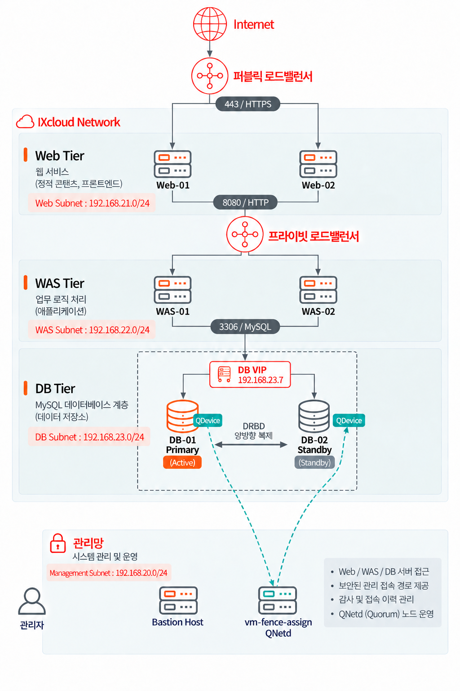

# InfraPass

인프라·보안 자격증 탐색과 수험 커뮤니티를 위한 **IXcloud 기반 3-Tier 고가용성 서비스**입니다.

**Cloud & Network**


**Web & Application**


**High Availability & Operations**


---

## 인프라 구축 및 필수 제출 내용

IXcloud에 Web / WAS / DB를 분리한 3-Tier 아키텍처를 구축했습니다. Web과 WAS는 각각 2대와 로드밸런서로 구성하고, DB는 **Pacemaker + Corosync + DRBD 기반 Active-Standby**로 구성했습니다. 관리망에는 Bastion Host와 QNetd 서버를 배치하고, DB 두 노드의 QDevice가 외부 정족수 중재에 참여합니다.

이 문서는 구축 아키텍처, 저장소의 애플리케이션 설정, 제출된 보안그룹 화면을 기준으로 작성했습니다. **현재 실습 환경에서는 IXcloud 컨트롤 플레인에 접근할 수 없어 STONITH/fencing을 적용하지 않았습니다.** QDevice 기반 정족수 중재까지 구성했으며, 클라우드 제어 권한을 확보한 후 펜싱을 연동하는 작업은 향후 계획에 포함합니다. 실제 클러스터 설정 파일과 장애 시험 로그는 저장소에 없으므로 세부 타임아웃과 복구 시간은 검증 완료로 표시하지 않습니다.

### 1. 전체 아키텍처와 통신 경로



외부 사용자의 서비스 요청은 다음 경로로 처리합니다.

```text
Internet → 퍼블릭 LB:443 (HTTPS 종료) → Web-01 / Web-02:80
  ├─ 정적 콘텐츠: Nginx에서 응답
  └─ /api/ 요청 → 프라이빗 LB:8080 → WAS-01 / WAS-02:8080
                                      → DB VIP 192.168.23.7:3306
                                      → 활성 DB의 MySQL

DB-01 ↔ DB-02                  : DRBD 복제 및 Corosync 클러스터 통신
DB-01 / DB-02의 QDevice → QNetd : TCP/5403, 외부 정족수 중재
관리자 → Bastion Host → 각 VM  : TCP/22, 관리용 SSH
```

도식의 HTTPS 443은 외부 접속 구간입니다. [Nginx 설정](deploy/nginx.conf)에서 Web은 HTTP 80으로 수신하고, API 요청을 내부 LB의 HTTP 8080으로 전달합니다. 정적 페이지 요청은 WAS와 DB를 경유하지 않습니다.

#### 서버와 접속 주소

| 계층 | 구성 | 주소 |
|---|---|---|
| 공개 진입점 | HTTPS 종료 퍼블릭 LB | 1.201.170.59 |
| WEB | Nginx, 정적 HTML/CSS/JavaScript | 192.168.21.8 / 192.168.21.5 |
| 내부 LB | HTTP 8080 → WAS 8080 | 192.168.22.19 |
| WAS | Python FastAPI + Uvicorn 2 workers | 192.168.22.6 / 192.168.22.9 |
| DB 접속 | MySQL 8.x, SQLAlchemy, PyMySQL | **192.168.23.7:3306 (VIP)** |
| DB 노드 | DRBD Active-Standby | 192.168.23.5 / 192.168.23.6 |
| 관리 접속 | Bastion Host | 192.168.20.7 |
| 정족수 중재 | vm-fence-assign, corosync-qnetd | 관리망에 배치 |

Node 빌드 없이 Nginx가 `web/`를 제공합니다. API는 같은 도메인의 `/api/`로 호출하며 CORS 개방 없이 Origin을 검사합니다. 세션·글·관심 자격증은 MySQL에 저장하여 WAS 사이에 공유합니다.

### 2. 서브넷 설계와 보안 근거

| 구분 | CIDR | 배치 대상 | 설계 근거 |
|---|---|---|---|
| 관리망 | `192.168.20.0/24` | Bastion Host, QNetd | 사용자 서비스와 관리 접속을 분리하고, DB 노드 외부에 정족수 중재 서버 배치 |
| Web Tier | `192.168.21.0/24` | Web-01, Web-02 | 외부 요청을 받는 프런트 계층을 업무·데이터 계층과 분리 |
| WAS Tier | `192.168.22.0/24` | 내부 LB `192.168.22.19`, WAS 2대 | Web의 API 요청만 내부 LB를 거쳐 처리하고 외부 직접 접근 차단 |
| DB Tier | `192.168.23.0/24` | DB 2대, VIP `192.168.23.7` | MySQL 접속을 WAS로 제한하고 복제·클러스터 통신 범위를 DB망으로 제한 |

서로 겹치지 않는 사설 `/24` 대역을 사용해 계층을 명확히 식별하고 서버 증설과 보안그룹 관리를 단순화했습니다. 관리망을 포함한 총 4개 서브넷으로, Web / WAS / DB 각각 독립 서브넷이라는 필수 조건을 충족합니다. 서브넷 분리만으로 접근이 차단되는 것은 아니므로 보안그룹과 라우팅 정책을 함께 적용합니다.

외부 공개 진입점은 퍼블릭 LB이며, Web VM의 공인 IP 직접 접속을 서비스 경로로 사용하지 않습니다. WAS와 DB는 사설 주소를 이용합니다. DB의 TCP/3306은 WAS에만 허용하며, DB 간 복제·클러스터 통신 및 Bastion의 SSH는 서비스 접속과 구분한 운영 예외입니다.

관리자는 허용된 관리자 공인 IP에서 Bastion으로 접속한 뒤 각 VM의 사설 IP로 SSH 접속합니다. 개별 VM의 SSH를 인터넷에 개방하지 않고 접속 경로를 집중하여 관리 범위와 로그 확인 지점을 줄입니다. SSH 키 인증과 접속 로그 수집·보관 정책은 운영 설정으로 관리합니다.

### 3. 사용한 인프라 도구와 역할

| 도구·구성요소 | 배치 | 역할 |
|---|---|---|
| IXcloud 네트워크·서브넷·보안그룹 | 전체 | 계층별 네트워크 분리와 출발지·목적지·포트 단위 접근 제어 |
| 퍼블릭 Load Balancer | 외부 진입점 | HTTPS 종료, Web 2대로 요청 분산, 헬스 체크 기반 장애 Web 제외 |
| Nginx | Web 2대 | 정적 콘텐츠 제공, `/api/`를 내부 LB로 프록시, `/healthz` 제공 |
| 프라이빗 Load Balancer | WAS망 | Web의 API 요청을 WAS 2대로 분산, 준비 상태 검사로 장애 WAS 제외 |
| FastAPI + Uvicorn | WAS 2대 | 업무 API 처리, VM당 2 workers, DB 기반 세션 공유 |
| systemd | WAS 및 각 인프라 서비스 호스트 | 서비스 기동·재시작 및 로그 조회. WAS는 `infrapass.service`로 관리 |
| MySQL | DB의 활성 노드 | 회원·세션·게시물·관심 목록 저장, VIP를 통한 단일 접속점 제공 |
| DRBD | DB 2대 | DB 데이터가 저장된 블록 장치를 노드 간 복제하는 스토리지 계층 |
| Corosync | DB 2대 | 노드 간 통신, 클러스터 멤버십 및 votequorum을 통한 정족수 판단 |
| Pacemaker | DB 2대 | DRBD 역할, 파일시스템, MySQL, VIP 리소스의 배치·감시·장애 복구를 조정 |
| pcs / pcsd | 클러스터 관리 대상 | Pacemaker·Corosync 구성 및 상태 관리. pcsd 관리 통신은 TCP/2224 |
| corosync-qdevice | DB 각 노드 | QNetd의 중재 결과를 Corosync 정족수 판단에 반영하는 클라이언트 |
| corosync-qnetd | 관리망의 vm-fence-assign | DB 노드 외부에서 정족수 중재를 수행하는 서버, TCP/5403 수신 |
| DB VIP | 현재 활성 DB 노드 | 장애 전환 후에도 WAS가 동일한 DB 주소로 재접속하도록 지원 |
| Bastion Host + SSH | 관리망 | 관리자의 내부 VM 접속을 중계 |

#### 3.1 Pacemaker — 리소스 배치와 복구 관리

Pacemaker는 클러스터에서 **어떤 서비스를 어느 노드에서 실행할지 결정하는 리소스 관리자**입니다. Corosync가 제공하는 노드 상태와 리소스 감시 결과를 바탕으로 서비스 시작·중지·재시작·이동을 조정합니다. 각 서비스는 Resource Agent를 통해 관리하며, 에이전트의 `start`, `stop`, `monitor` 같은 동작을 호출합니다. DRBD처럼 역할이 있는 리소스에는 승격·강등 동작도 사용합니다. [Pacemaker 리소스 문서](https://clusterlabs.org/projects/pacemaker/doc/3.0/Pacemaker_Explained/html/resources.html)

이 구성에서 관리할 대상은 DRBD 역할, DB 파일시스템, MySQL, DB VIP입니다. 데이터가 준비되기 전에 MySQL이 기동하거나 VIP만 다른 노드로 이동하지 않도록 다음 제약을 함께 사용합니다.

- **순서 제약(Ordering):** DRBD Primary 승격 → 파일시스템 마운트 → MySQL 시작 → VIP 활성화 순서로 의존관계를 정의합니다.
- **동일 노드 배치 제약(Colocation):** MySQL과 VIP를 쓰기 가능한 DRBD 및 파일시스템이 있는 노드에 배치합니다.
- **감시·복구 정책:** 리소스 상태를 주기적으로 확인하고, 실패 시 재시작 또는 다른 노드로의 이동을 판단합니다. 감시 주기·실패 임계값·타임아웃은 실제 설정에 따릅니다.

Pacemaker 자체가 DB 데이터를 복제하지는 않습니다. 데이터 복제는 DRBD가 담당하고, Pacemaker는 복제 장치와 서비스를 올바른 순서로 운용합니다. 현재는 펜싱이 미적용되어 응답하지 않는 기존 활성 노드를 강제로 격리하는 단계가 빠져 있습니다.

#### 3.2 Corosync — 노드 통신, 멤버십, 정족수

Corosync는 DB 노드 사이의 클러스터 통신을 담당합니다. 노드가 클러스터에 참가하거나 이탈했는지 파악하는 **멤버십 정보**를 제공하고, `votequorum`은 현재 연결된 구성원이 서비스를 계속할 수 있는 정족수를 갖추었는지 판단합니다. Pacemaker는 이 정보를 리소스 운영 정책에 반영합니다.

DB 두 대만 각각 1표를 가지면 통신 단절 시 어느 쪽을 유지해야 할지 판단하기 어렵습니다. 이 설계는 QDevice의 중재표를 더해 **총 3표 중 2표**를 정족수로 사용합니다. Corosync가 연결 단절을 감지했다고 해서 상대 노드의 전원이나 MySQL이 실제로 중지되었다는 뜻은 아닙니다. 정족수 상실 시 리소스를 어떻게 처리하는지는 Pacemaker 정책과 함께 확인해야 합니다.

제출 화면에는 DB망 내부 UDP/5404·5405가 허용되어 있습니다. 이는 등록된 규칙이며, 실제 필요한 포트는 설치 버전과 Corosync transport 설정에 따라 대조합니다. Corosync의 투표와 DRBD 자체의 데이터 접근·정족수 기능은 별도 계층의 기능입니다. [Corosync votequorum 매뉴얼](https://github.com/corosync/corosync/blob/main/man/votequorum.5)

#### 3.3 DRBD — DB 저장 장치의 블록 복제

DRBD는 두 서버의 저장 장치를 네트워크로 연결하여 **블록 장치에 발생하는 쓰기를 상대 노드에 복제**합니다. MySQL은 활성 노드의 파일시스템에 데이터를 기록하고, 그 아래에 있는 DRBD가 변경 블록을 복제합니다. 따라서 이 구성은 MySQL의 SQL 문이나 binlog를 전달하는 DB 자체 복제와 구분됩니다.

단일 Primary 구조에서 Primary는 쓰기 가능한 장치를 제공하고, Secondary는 복제 데이터를 유지합니다. 정상 상태에서는 활성 DB 노드에서만 파일시스템을 마운트하고 MySQL을 실행합니다. 장애 인계 시에는 데이터 상태를 확인한 후 대기 노드를 Primary로 승격하고 서비스를 시작합니다.

복제 프로토콜은 쓰기 완료를 응답하는 시점을 결정합니다. 예를 들어 **Protocol C는 양쪽 디스크의 쓰기 완료를 확인하는 동기 복제 방식**입니다. 다만 현재 저장소에 실제 DRBD 설정이 없으므로 Protocol C 적용이나 데이터 손실 0을 단정하지 않습니다. 복제 프로토콜, 연결 상태, 양쪽 디스크의 최신 여부, 재동기화 완료 여부를 함께 확인해야 합니다.

DRBD는 데이터 삭제나 손상도 복제할 수 있으므로 백업을 대체하지 않습니다. 노드 간 연결이 끊긴 상태에서 양쪽에 서로 다른 쓰기가 발생하면 데이터가 갈라지는 split-brain 문제가 생길 수 있습니다. 현재 펜싱 미적용 범위를 고려하여 단일 쓰기 노드 확인을 전제로 운용합니다. [DRBD 사용자 가이드](https://linbit.com/drbd-user-guide/drbd-guide-9_0-en/)

#### 3.4 QDevice — DB 노드에서 동작하는 중재 클라이언트

`corosync-qdevice`는 **각 DB 노드에 설치되는 클라이언트 데몬**입니다. 외부 QNetd 서버와 통신하여 받은 판단을 Corosync의 정족수 계산에 반영합니다. 두 DB에 클라이언트를 각각 설치하더라도 도식의 중재표는 클러스터 전체 기준 1표이며, 클라이언트 수만큼 독립적인 중재표가 생기는 구조는 아닙니다.

DB 간 통신이 단절되어 클러스터가 나뉘면 QNetd와의 연결, 멤버십, 설정된 알고리즘 등에 따라 중재 결과가 달라집니다. 제출된 양쪽 DB와 QNetd 상태 출력에서 실제 알고리즘은 **Fifty-Fifty split (`ffsplit`)**, tie-breaker는 **가장 낮은 Node ID**로 확인했습니다. QDevice가 표를 제공하는 상태와 단순히 QNetd에 연결된 상태도 구분해서 확인합니다. [QDevice 공식 매뉴얼](https://github.com/corosync/corosync-qdevice/blob/main/man/corosync-qdevice.8)

QDevice는 MySQL을 기동하거나 VIP를 이동하지 않고, 상대 DB의 전원을 끄지도 않습니다. 투표 결과를 사용하는 주체는 Corosync와 Pacemaker이며, 실제 노드 격리는 별도 펜싱의 역할입니다.

#### 3.5 QNetd — 관리망의 외부 중재 서버

`corosync-qnetd`는 관리망의 `vm-fence-assign`에서 동작하는 **외부 중재 서버**입니다. DB의 QDevice 클라이언트가 QNetd의 TCP/5403으로 접속하고, QNetd는 클러스터 상태와 중재 알고리즘에 따라 판단을 제공합니다. DB 노드 외부에 배치하여 DB 두 노드만으로 결정을 내려야 하는 상황을 보완합니다.

QNetd는 DB 데이터를 보관하는 세 번째 복제 노드가 아니며, 이 호스트에서는 펜싱을 수행하지 않습니다. 서버 이름에 `fence`가 포함되어 있어도 현재 역할은 QNetd입니다. DB 두 대가 서로 연결된 상태에서 QNetd만 중단되면 도식상 DB 2표로 정족수를 유지할 수 있지만, 추가 DB 장애에 대비한 중재 기능은 잃게 됩니다. [QNetd 공식 매뉴얼](https://github.com/corosync/corosync-qdevice/blob/main/man/corosync-qnetd.8)

#### 3.6 pcs / pcsd — 클러스터 구성과 상태 관리

`pcs`는 Pacemaker·Corosync의 리소스, 제약, 클러스터 속성과 상태를 관리하는 명령행 도구입니다. `pcsd`는 노드 인증과 구성 관리 통신을 지원하는 데몬이며, 제출 화면에는 TCP/2224가 등록되어 있습니다. `pcs status`로 노드와 리소스 상태를 확인하고, 실제 구성 출력으로 리소스 배치·순서 제약을 대조합니다.

이 관리 통신은 DRBD 복제 트래픽이나 Corosync의 노드 간 통신과 목적이 다릅니다. pcsd 접근은 클러스터를 관리하는 출발지로 제한합니다. pcs는 설정을 관리하는 도구이며, 실행 중 리소스의 배치·복구 판단은 Pacemaker가 수행합니다. [pcs 프로젝트 문서](https://github.com/ClusterLabs/pcs)

#### 3.7 DB VIP와 systemd — 접속 주소와 프로세스 관리

**DB VIP `192.168.23.7`**은 WAS가 사용하는 고정 접속 주소입니다. 활성 DB가 바뀌면 VIP도 서비스를 인계받은 노드에 배치하여 애플리케이션 설정 변경을 줄입니다. VIP 이동이 기존 TCP 연결과 진행 중 트랜잭션까지 이전하는 것은 아니므로, WAS의 재연결과 요청 재시도가 필요합니다.

**systemd**는 각 VM의 서비스 프로세스를 관리합니다. WAS에서는 Uvicorn 기동·재시작과 로그 조회에 사용합니다. DB에서는 Pacemaker가 관리하는 MySQL·파일시스템을 별도 자동 기동 경로와 충돌시키지 않도록 관리 주체를 일치시켜야 합니다. 노드 한 대 내부의 프로세스 재시작과 여러 노드 사이의 서비스 인계는 각각 systemd와 클러스터 관리 계층의 역할입니다.

**현재 적용 범위:** Pacemaker 리소스 관리 + Corosync 멤버십·정족수 + DRBD 복제 + QDevice/QNetd 외부 중재. **향후 적용 범위:** IXcloud 컨트롤 플레인 접근 권한 확보 후 STONITH/fencing 연동. 정족수 중재만으로 응답하지 않는 노드의 쓰기 중단까지 보장하지는 않습니다. [Pacemaker 펜싱 문서](https://clusterlabs.org/projects/pacemaker/doc/3.0/Pacemaker_Explained/html/fencing.html)

### 4. 계층별 이중화 및 장애 전환 설계

#### Web: 퍼블릭 LB + Nginx 2대

퍼블릭 LB가 Web 두 대로 트래픽을 분산합니다. 두 Web에는 동일한 정적 파일과 Nginx 설정을 배포하며, LB는 HTTP 80의 `/healthz`를 검사합니다. 한 Web이 중단되면 헬스 체크 실패 판정 후 해당 서버를 풀에서 제외하고 정상 서버로 새 요청을 전달합니다. 배포도 한 대씩 풀에서 제외하여 진행합니다.

#### WAS: 프라이빗 LB + 애플리케이션 2대

Web은 `192.168.22.19:8080`의 내부 LB로 API 요청을 전달합니다. 내부 LB는 WAS 두 대의 `/api/health/ready`를 검사하여 정상 인스턴스로만 요청을 전달합니다. 이 엔드포인트는 `SELECT 1`로 DB 연결까지 확인합니다. 세션을 MySQL에 저장하므로 다른 WAS가 다음 요청을 처리해도 동일한 로그인 상태를 조회할 수 있습니다.

장애 감지·풀 제외 전의 요청이나 이미 처리 중이던 요청은 실패할 수 있습니다. DB가 공통으로 중단되면 두 WAS의 readiness가 함께 실패할 수 있으며, 이때 API 오류 응답은 WAS의 503 또는 LB·프록시의 오류로 나타날 수 있습니다. LB의 검사 주기, 실패·복귀 임계값, 분산 알고리즘은 실제 LB 설정값을 증빙에 기록합니다.

#### DB: DRBD + Pacemaker + Corosync + QDevice

정상 상태는 DB-01을 Active, DB-02를 Standby로 둔 단일 활성 구조입니다. 활성 노드에서만 DB 파일시스템과 MySQL을 사용하고, WAS는 노드별 IP 대신 `192.168.23.7:3306`으로 접속합니다. DRBD는 블록 단위 복제이며 MySQL binlog 기반 복제와는 구분합니다. DRBD 버전·복제 프로토콜·디스크 및 마운트 경로는 실제 설정 파일을 기준으로 기록해야 합니다. [DRBD 사용자 가이드](https://linbit.com/drbd-user-guide/drbd-guide-9_0-en/)

장애 전환은 다음 의존관계를 따릅니다. **현재는 펜싱이 없으므로 아래 인계 절차는 기존 활성 노드의 정상 중지 또는 실제 정지를 확인할 수 있는 실습 조건을 전제로 합니다.** 네트워크 응답이 없다는 사실만으로 기존 노드의 정지를 판단하지 않습니다. 실제 자동 복구 동작과 리소스 제약은 `pcs` 설정·시험 결과로 대조합니다.

1. Corosync와 Pacemaker가 노드 또는 리소스 장애를 감지합니다. 리소스 장애는 설정된 복구 정책에 따라 재시작 또는 다른 노드로의 이동 대상이 됩니다.
2. 정족수·복제 데이터 상태와 기존 활성 노드의 쓰기 중단을 확인합니다. 기존 노드의 상태를 확인할 수 없는 경우 자동 격리를 보장할 수 없으므로, 강제 승격에 앞서 운영자 확인이 필요합니다. 이 격리 단계를 자동화하는 펜싱은 향후 적용합니다.
3. 서비스 인계가 가능한 DB 노드의 DRBD를 Primary로 승격합니다.
4. 해당 노드에서 DB 파일시스템을 마운트하고 MySQL을 시작합니다.
5. 같은 노드에서 VIP를 활성화하여 WAS의 새 연결을 받습니다. DRBD Primary·파일시스템·MySQL·VIP를 같은 노드에 두는 배치 제약과 시작 순서 제약이 필요합니다.
6. WAS가 동일 VIP로 재접속하고 readiness가 회복되면 내부 LB가 정상 요청 처리를 재개합니다.

애플리케이션은 `pool_pre_ping`으로 끊어진 DB 연결을 감지하지만 진행 중 트랜잭션의 복구까지 보장하지는 않습니다. DB 연결 오류를 처리할 때는 503을 반환하며, 게시물 등록은 동일 사용자·요청 ID의 중복 생성을 방지합니다. 장애 후 같은 요청 ID로 재시도하여 응답 유실에 대응합니다.

복귀한 기존 노드는 데이터 상태와 재동기화를 확인한 뒤 Standby로 편입합니다. 자동 원복 여부는 리소스 선호도·유지 정책에 따르며, 두 노드에서 DB를 동시에 쓰기 가능 상태로 만들지 않습니다. 클라우드 네트워크에서 VIP 이동을 허용하는 포트 보안·주소 허용 설정도 인계 시험으로 확인합니다.

도식은 **DB 2표 + QDevice 1표 = 총 3표, 정족수 2표**를 기준으로 합니다. DB 한 대와 QNetd가 정상 통신하면 생존 DB 1표와 중재표 1표로 서비스 지속을 판단할 수 있습니다. DB 간 통신이 분리되었을 때 어느 쪽에 중재표를 줄지는 QDevice 알고리즘과 연결 상태에 따릅니다. QNetd만 중단되고 DB 두 대가 정상 통신하면 DB 2표로 정족수를 유지할 수 있지만, 추가로 DB 한 대까지 잃으면 이 설계 기준의 정족수를 충족하지 못합니다. 실제 투표 설정과 상태는 `corosync-quorumtool -s`로 확인합니다. [Red Hat 정족수 장치 구성 문서](https://docs.redhat.com/en/documentation/red_hat_enterprise_linux/8/html/configuring_and_managing_high_availability_clusters/assembly_configuring-quorum-devices-configuring-and-managing-high-availability-clusters)

QNetd는 DB 데이터를 저장하거나 복제하는 세 번째 DB 노드가 아닙니다. QDevice 클라이언트에서 QNetd 서버의 TCP/5403으로 연결합니다. [Corosync QDevice 공식 매뉴얼](https://github.com/corosync/corosync-qdevice/blob/main/man/corosync-qdevice.8)

### 5. 보안그룹별 정책표

최신 제출 화면의 **현재 허용 규칙**을 Web / WAS / DB / 관리망의 4개 표로 정리했습니다. 각 표는 요구사항의 출발지 / 목적지 / 포트·프로토콜 / 방향 / 허용 사유 형식을 따릅니다. `In`은 해당 그룹이 적용된 VM의 수신, `Out`은 송신입니다. IPv6로 표시한 행을 제외하면 IPv4 규칙입니다.

이번 화면에서 Web TCP/80의 출발지가 `0.0.0.0/0`에서 `192.168.21.0/24`로 축소되었고, Web·DB의 TCP/5403 수신 규칙이 삭제된 것을 확인했습니다. 관리망의 DB → QNetd TCP/5403 규칙은 유지되어 있습니다. 변경 후 DB·QNetd 연결과 투표는 제출된 명령 출력으로 확인했습니다. Web·WAS·외부 서비스·LB 상태는 사용자 정상 확인 결과이며, 상세 근거는 6.1에 구분해 기록했습니다.

#### 5.1 Web — `sg-assignment-web`

**서비스 대상:** Web-01 / Web-02 · **서브넷:** `192.168.21.0/24` · **역할:** 정적 콘텐츠 제공 및 내부 LB로 API 전달

| 출발지(Source) | 목적지(Dest.) | 포트/프로토콜 | 방향(In/Out) | 허용 사유 |
|---|---|---|---|---|
| `192.168.21.0/24` | Web 그룹 VM | TCP/80 | In | 퍼블릭 LB 전달 트래픽 수신, 화면 설명 `public lb` |
| Bastion `192.168.20.7/32` | Web 그룹 VM | TCP/22 | In | 관리용 SSH |
| Web 그룹 VM | `169.254.169.254/32` | TCP/80 | Out | 클라우드 메타데이터 접근 |
| Web 그룹 VM | `0.0.0.0/0` | ALL | Out | IPv4 전체 송신 허용 |
| Web 그룹 VM | `::/0` | ALL | Out | IPv6 전체 송신 허용 |

**설계 의도:** 외부 사용자는 퍼블릭 LB의 HTTPS 443으로 접속하고, TLS 종료 후 Web의 HTTP 80으로 요청이 전달됩니다. LB의 VIP 서브넷 ID는 Web 서브넷과 일치하며, 현재 Web:80은 해당 사설 대역 `192.168.21.0/24`에서 오는 연결만 허용합니다. 이 규칙은 LB만 식별하는 규칙이 아니라 Web 서브넷 전체를 허용하는 범위입니다.

**패킷 확인:** Web-01 `192.168.21.8:80`에 `192.168.21.26`과 `192.168.21.18`에서 약 5초 간격으로 연결 시도·종료 패킷이 들어왔습니다. TCP 헬스 체크로 추정되는 패턴이며, 두 출발지는 허용 대역에 포함됩니다. 이 기록만으로 두 주소를 LB의 전체 구성 주소로 확정하거나 실제 사용자 요청까지 확인했다고 볼 수는 없습니다. 이후 Web·WAS·외부 페이지·API 및 LB 확인 항목은 사용자가 모두 정상이라고 확인했습니다. 다만 Web-02의 구체적인 패킷 출발지와 전체 LB 주소 목록은 출력이 제공되지 않아 문서에 확정하지 않습니다.

Web의 업무 송신 경로는 내부 LB `192.168.22.19:8080`입니다. 관리망에 배치한 QNetd와 무관한 Web TCP/5403 수신 규칙은 최신 화면에서 삭제되었습니다.

#### 5.2 WAS — `sg-assignment-was`

**서비스 대상:** WAS-01 / WAS-02 · **서브넷:** `192.168.22.0/24` · **역할:** 내부 LB의 API 요청 처리 및 DB 접근

| 출발지(Source) | 목적지(Dest.) | 포트/프로토콜 | 방향(In/Out) | 허용 사유 |
|---|---|---|---|---|
| `192.168.22.0/24` | WAS 그룹 VM | TCP/8080 | In | API 수신, 화면 설명 `from web` |
| Bastion `192.168.20.7/32` | WAS 그룹 VM | TCP/22 | In | 관리용 SSH |
| WAS 그룹 VM | `169.254.169.254/32` | TCP/80 | Out | 클라우드 메타데이터 접근 |
| WAS 그룹 VM | `0.0.0.0/0` | ALL | Out | IPv4 전체 송신 허용 |
| WAS 그룹 VM | `::/0` | ALL | Out | IPv6 전체 송신 허용 |

**설계 의도:** 서비스 요청은 Web → 내부 LB → WAS로 전달합니다. 화면의 TCP/8080 출발지는 Web망이 아닌 WAS망이지만, 내부 LB `192.168.22.19`가 이 대역에 있으므로 LB 경유 구조와 양립할 수 있습니다. 내부 LB의 SNAT·원본 IP 보존 방식과 헬스 체크 출발지를 확인하여 필요한 주소만 허용하고 규칙 설명을 정리합니다.

WAS의 DB 접속 대상은 VIP `192.168.23.7:3306`입니다. 외부에서 WAS로 직접 접속하는 경로는 서비스 설계에 포함하지 않습니다.

#### 5.3 DB — `sg-assignment-db`

**서비스 대상:** DB-01 / DB-02 · **서브넷:** `192.168.23.0/24` · **역할:** MySQL 서비스, DRBD 복제, 클러스터 통신

| 출발지(Source) | 목적지(Dest.) | 포트/프로토콜 | 방향(In/Out) | 허용 사유 |
|---|---|---|---|---|
| WAS망 `192.168.22.0/24` | DB 그룹 VM | TCP/3306 | In | WAS의 MySQL 접속 |
| DB망 `192.168.23.0/24` | DB 그룹 VM | TCP/7789 | In | DRBD 복제용 후보 포트, 화면 설명은 `mysql` |
| DB망 `192.168.23.0/24` | DB 그룹 VM | UDP/5404 | In | Corosync 클러스터 통신 |
| DB망 `192.168.23.0/24` | DB 그룹 VM | UDP/5405 | In | Corosync 클러스터 통신 |
| DB망 `192.168.23.0/24` | DB 그룹 VM | TCP/2224 | In | pcsd 클러스터 관리 |
| Bastion `192.168.20.7/32` | DB 그룹 VM | TCP/22 | In | 관리용 SSH |
| DB 그룹 VM | `169.254.169.254/32` | TCP/80 | Out | 클라우드 메타데이터 접근 |
| DB 그룹 VM | `0.0.0.0/0` | ALL | Out | IPv4 전체 송신 허용 |
| DB 그룹 VM | `::/0` | ALL | Out | IPv6 전체 송신 허용 |

**설계 의도:** MySQL의 서비스 수신은 WAS로 제한하고, 외부 및 Web에서의 직접 DB 접속은 허용하지 않습니다. TCP/3306의 허용 범위를 WAS 두 IP로 좁히면 같은 서브넷의 다른 VM 접근도 제한할 수 있습니다. DB 간 복제·클러스터 통신과 Bastion SSH는 별도 운영 목적의 예외입니다.

TCP/7789는 실제 DRBD 리소스 설정과 대조한 뒤 설명을 복제용으로 정리해야 합니다. Corosync 포트도 실제 transport 설정과 일치하는지 확인합니다. 기존 `192.168.20.20/32` → DB TCP/5403 수신 규칙은 최신 화면에서 삭제되었습니다. 필요한 연결은 **DB → 관리망 QNetd:5403**이며, DB의 현재 전체 송신 허용과 관리망의 TCP/5403 수신 규칙으로 허용됩니다. 변경 후 양쪽 DB의 QDevice가 Connected이고, 총 3표·정족수 2·Quorate Yes인 것을 확인했습니다. QNetd에서도 두 DB 클라이언트와 ACK 상태가 확인되었습니다.

#### 5.4 관리망 — `sg-assignment-management`

**설계상 대상:** Bastion Host / QNetd · **서브넷:** `192.168.20.0/24` · **역할:** 관리자 접속 중계 및 외부 정족수 중재

| 출발지(Source) | 목적지(Dest.) | 포트/프로토콜 | 방향(In/Out) | 허용 사유 |
|---|---|---|---|---|
| 관리자 공인 IP `1.201.194.31/32` | 관리 그룹 VM | TCP/22 | In | 허용된 관리자의 SSH 접속 |
| Bastion `192.168.20.7/32` | 관리 그룹 VM | TCP/22 | In | 관리망 내부 SSH 접속 |
| DB망 `192.168.23.0/24` | 관리 그룹 VM | TCP/5403 | In | DB QDevice → QNetd 중재 연결 |
| DB망 `192.168.23.0/24` | 관리 그룹 VM | TCP/2224 | In | pcsd 인증·구성 관리 |
| 관리 그룹 VM | `169.254.169.254/32` | TCP/80 | Out | 클라우드 메타데이터 접근 |
| 관리 그룹 VM | `0.0.0.0/0` | ALL | Out | IPv4 전체 송신 허용 |
| 관리 그룹 VM | `::/0` | ALL | Out | IPv6 전체 송신 허용 |

**설계 의도:** 외부 관리자는 Bastion을 경유하여 내부 VM에 접근합니다. 관리 그룹이 Bastion과 QNetd에 함께 연결된다면 공인 IP의 SSH 허용이 어느 VM에 적용되는지 확인하고, 외부 SSH 진입은 Bastion으로 한정합니다. TCP/5403은 DB QDevice의 중재 요청을 받는 QNetd에 필요한 규칙이며, 펜싱용 포트가 아닙니다.

#### 5.5 공통 접근 원칙과 송신 정책

- **외부 서비스 진입:** 퍼블릭 LB `1.201.170.59`의 TCP/443을 사용하고, LB의 HTTP 80은 HTTPS 리다이렉트에 사용합니다. 이 리스너 구성은 위 VM 보안그룹 규칙과 별도로 확인합니다.
- **계층 간 경로:** 퍼블릭 LB → Web:80 → 내부 LB:8080 → WAS:8080 → DB VIP:3306 순서로 업무 통신을 허용합니다. Web → DB 직접 서비스 접근은 차단하는 설계입니다.
- **관리 경로:** 허용된 관리자 → Bastion → 내부 VM의 TCP/22를 사용합니다. 클러스터 관리 TCP/2224는 실제 관리 작업 출발지와 대상에 한정합니다.
- **현재 송신 범위:** 네 그룹 모두 IPv4·IPv6 전체 송신을 허용합니다. 최소 송신 정책을 적용한 상태는 아니며, 계층 간 업무 통신과 DB 복제·QNetd 연결 외에 실제 DNS·NTP·업데이트 목적지를 확인한 뒤 축소를 검토합니다.
- **적용 확인:** 보안그룹의 VM 연결, 라우팅, LB 전달 출발지까지 함께 대조합니다. 상태 추적형 보안그룹의 허용 연결에 대한 응답과 별도 신규 수신 서비스는 구분합니다.

### 6. 장애 시나리오와 검증 방법

#### 6.1 보안그룹 변경 후 정상 상태 확인

**확인 시점:** DB 출력 기준 2026-09-14 16:11:33~16:11:38 (서버 표시 시각). DB-01·DB-02와 QNetd 서버의 명령 출력으로 아래 상태를 확인했습니다.

| 확인 항목 | 실제 결과 | 확인 근거 |
|---|---|---|
| 클러스터 | `mysql-ha`, db01·db02 모두 Online | 양쪽 `pcs status --full` |
| Pacemaker | Current DC `db02`, 표시 버전 `3.0.1-3.0.1` | 클러스터 요약 |
| DRBD 리소스 | `drbd_mysql-clone`: db01 Promoted, db02 Unpromoted | Pacemaker 리소스 목록 |
| DRBD 복제 상태 | 리소스 `mysql`: db01 Primary / db02 Secondary, 양쪽 디스크 UpToDate, 복제 Established | 양쪽 `drbdadm status` |
| 파일시스템 | `mysql_fs` (`ocf:heartbeat:Filesystem`) Started db01 | Pacemaker 리소스 목록 |
| MySQL | `mysql_service` (`systemd:mysql`) Started db01 | Pacemaker 리소스 목록 |
| VIP | `mysql_vip` (`ocf:heartbeat:IPaddr2`) Started db01, `192.168.23.7/24`은 db01에만 존재 | 리소스 목록 및 양쪽 `ip -brief address` |
| 정족수 | Expected votes 3, Total votes 3, Quorum 2, Quorate Yes | 양쪽 `corosync-quorumtool -s` |
| QDevice | 양쪽 Connected, QNetd `192.168.20.20:5403` | 양쪽 `corosync-qdevice-tool -s` |
| 중재 알고리즘 | Fifty-Fifty split, 가장 낮은 Node ID 기준 tie-breaker | DB·QNetd 상태 출력 |
| QNetd 서버 | `vm-fence-assign`, 서비스 active, TCP `*:5403` LISTEN | `systemctl is-active`, `ss -lntp` |
| QNetd 클라이언트 | db01 `192.168.23.5`, db02 `192.168.23.6` 모두 연결, Vote는 각각 `ACK (ACK)`, `No change (ACK)` | `corosync-qnetd-tool -l` |

현재 출력에서 DRBD Primary·파일시스템·MySQL·VIP가 db01에 함께 배치되어 있고, db02는 복제 데이터를 유지하는 Secondary입니다. QNetd 연결과 중재표도 정상적으로 참여하고 있어, DB의 역방향 TCP/5403 수신 규칙 삭제 후에도 필요한 DB → QNetd 연결이 유지됨을 확인했습니다.

**사용자 확인 결과:** Web 두 대의 Nginx·`/healthz`, Web에서 내부 LB로의 readiness 접속, WAS 두 대의 서비스·readiness, 외부 페이지·API 접속 및 LB 멤버 상태는 사용자가 나머지 점검 항목 모두 정상이라고 확인했습니다. 해당 항목의 개별 명령 출력과 콘솔 캡처는 이번 결과에 포함되지 않았습니다.

이번 결과는 정상 운영 시점의 상태 점검입니다. 실제 장애 주입과 DB 인계 성공, 리소스 순서 제약, DRBD 복제 프로토콜, RTO/RPO까지 검증한 자료는 아닙니다. 펜싱은 기존에 명시한 사유로 미적용이며 향후 계획으로 유지합니다.

#### 6.2 장애 시나리오

| 장애 시나리오 | 대응·예상 동작 | 확인할 증빙 |
|---|---|---|
| Web 한 대 중단 | 퍼블릭 LB가 실패한 Web을 제외하고 나머지 Web으로 신규 요청 전달 | LB 멤버 상태, 정적 페이지·API 응답, 정상 Web 접근 로그 |
| WAS 한 대 중단 | 내부 LB가 readiness 실패를 감지해 정상 WAS로 요청 전달 | 내부 LB 상태, 기존 로그인으로 조회·글 작성 성공 |
| 활성 DB 중단 | 기존 활성 노드의 실제 정지·정족수·복제 상태를 확인할 수 있는 조건에서 Standby로 인계 | 전후 `pcs status`, DRBD 역할·디스크 상태, VIP 위치, 기존 데이터 및 신규 쓰기 |
| DB 간 통신 단절 | QDevice 중재 결과와 클러스터 정책 확인. 현재 펜싱이 없어 기존 쓰기 중단을 확인하기 전 강제 승격을 피하고 운영자가 상태 확인 | quorum 상태, QDevice 투표, 양쪽 MySQL·VIP·DRBD 상태. 자동 격리 검증은 향후 펜싱 적용 후 수행 |
| QNetd만 중단 | DB 두 노드가 연결된 상태에서는 도식의 2표 정족수 유지, 중재 장치 복구 | QDevice 연결 상태, DB 두 노드의 quorum 및 서비스 상태 |

장애 전에는 로그인·게시물·관심 목록을 준비하고 정상 클러스터 상태를 기록합니다. 통제된 실습 환경에서 한 번에 한 장애를 주입한 뒤 장애 감지 시각, 전환 완료 시각, 실패한 요청과 데이터 보존 여부를 기록합니다. 정상 복구 후에는 재동기화와 LB 복귀까지 확인합니다. **위 표는 시험 시나리오이며 실제 시험 통과 결과나 RTO/RPO 측정값을 대신하지 않습니다.**

다음은 상태 확인용 명령입니다. 설치 버전에 따라 명령 형식이 다를 수 있으므로 지원 옵션을 확인합니다.

```bash
# DB 노드: 리소스 배치, 정족수, QDevice, DRBD, VIP 확인
sudo pcs status --full
sudo corosync-quorumtool -s
sudo corosync-qdevice-tool -s
sudo drbdadm status
ip -brief address

# QNetd 서버: 클라이언트 연결 상태
sudo corosync-qnetd-tool -l

# Web / WAS: 각 해당 VM에서 확인
curl --fail http://127.0.0.1/healthz
curl --fail http://127.0.0.1:8080/api/health/ready
```

현재 제출 증빙에는 LB 설정과 멤버 상태, VM·서브넷·보안그룹 연결, Pacemaker 리소스·순서·동일 노드 배치 제약, DRBD 설정·동기화 상태, Corosync/QDevice 투표 상태를 포함합니다. 펜싱은 미적용 사유와 향후 계획을 기록하며, 격리 성공 증빙은 적용 후 추가합니다. 비밀번호·인증키를 제외한 설정과 장애 전후 로그로 문서의 설계를 대조합니다. LB 자체의 가용성은 클라우드 제공 구성을 확인해야 하며, 단일 Bastion·QNetd의 장애 영향과 DRBD와 별개인 DB 백업·복구도 운영 범위로 관리합니다.

### 7. 필수 제출 항목 대응표

| 요구사항 | 본 문서의 대응 위치 |
|---|---|
| 전체 아키텍처 다이어그램 1부 | 1. 전체 아키텍처와 통신 경로 |
| Web / WAS / DB 서브넷 분리, CIDR 및 설계 근거 | 2. 서브넷 설계와 보안 근거 |
| Web 외부 접속 경로 및 공인 IP·LB 사용 명시 | 1. 통신 경로·서버 주소, 2. 외부 공개 방식 |
| WAS 외부 직접 노출 방지, DB의 WAS 전용 서비스 접근 | 2. 접근 원칙, 5. 보안정책 및 현재 규칙 대조 |
| Bastion 등을 통한 관리자 접근 방식과 이유 | 2. 관리자 SSH 경로, 5. 관리 통신 정책 |
| 출발지·목적지·포트/프로토콜·방향·허용 사유 표 | 5.1~5.4 보안그룹별 정책표 |
| 보안 관점의 항목별 설계 근거 | 2. 서브넷 설계, 5. 허용 사유 및 대조 사항 |
| Web 2대 이상 + LB | 4. Web 이중화 |
| WAS 2대 이상 + 장애 인스턴스 제외 | 4. WAS 이중화 |
| DB 복제 및 Standby failover | 3. 인프라 도구, 4. DB 고가용성 |
| 선택: 장애 시나리오 및 이중화 세부 동작 | 4. 전환 순서·정족수, 6. 장애 시나리오와 검증 |

### 8. 향후 인프라 개선 계획

#### STONITH/fencing 연동

현재 실습 계정에서는 **IXcloud 컨트롤 플레인에 접근할 수 없어 VM 전원 제어를 이용한 펜싱을 적용하지 않았습니다.** QDevice/QNetd는 정족수를 중재하지만 장애 노드의 전원을 끄거나 쓰기 접근을 강제로 차단하지 않습니다. 따라서 현재 구성을 네트워크 단절까지 안전하게 자동 복구하는 펜싱 완료 구성으로 보지 않습니다.

향후 클라우드 운영 측의 지원과 필요한 제어 권한을 확보하면 다음 순서로 보완합니다.

1. **제어 방식 확인:** IXcloud가 제공하는 VM 전원 제어 인터페이스, 인증·권한 범위, 접근 경로를 확인하고 사용 가능한 fence agent 또는 연동 방식을 선정합니다.
2. **클러스터 연동:** DB 노드와 클라우드 VM 식별자를 정확히 매핑하고 Pacemaker에 펜싱 리소스를 등록합니다. 인증정보는 저장소에 포함하지 않습니다.
3. **복구 정책 보완:** 기존 활성 노드 격리 성공을 확인한 후 DRBD 승격·파일시스템·MySQL·VIP 인계를 진행하도록 관련 제약과 실패 처리 정책을 검토합니다. 펜싱 실패 시에도 안전성이 유지되는지 확인합니다.
4. **장애 시험:** DB 노드 무응답, DB 간 네트워크 단절, 펜싱 인터페이스 장애를 나누어 시험하고 격리 로그·단일 활성 상태·복구 시간을 기록합니다.

#### 운영 보완

- **보안그룹 후속 검증:** Web:80의 사설 대역 제한과 Web·DB의 불필요한 TCP/5403 수신 규칙 삭제는 최신 화면에 반영되었습니다. QDevice 연결·투표는 제출 출력으로, 외부 페이지·API 및 Web·WAS·LB 상태는 사용자 정상 확인으로 기록했습니다. WAS·DB의 서비스 수신 범위와 관리 그룹의 SSH 적용 대상을 추가 검토하고, 송신 전체 허용은 필요한 목적지 중심으로 축소를 검토합니다.
- **백업·복구 검증:** DRBD 복제와 별도로 MySQL 백업, 복원 절차, 데이터 보존 및 복구 시간을 확인합니다.
- **가용성 관측:** LB 멤버 상태, 클러스터 리소스 실패, DRBD 재동기화, QDevice 연결·투표 상태를 모니터링하고 장애 시험 결과를 축적합니다.

## 구현된 기능

- 106개 초기 자격증 카탈로그, 이름·약칭 검색, 분야·국내외 필터
- 자격증 개요, 대상, 취득 과정, 시험, 학습, 유지·갱신, 후기·질문 탭
- 회원가입·로그인·로그아웃, Argon2 비밀번호 해시, HttpOnly 세션 쿠키
- 관심 자격증 저장, 나의 학습 페이지
- 후기·질문·공부 기록·스터디 게시물, 후기 추가 항목, 댓글, 페이지 추가 조회
- 정보 수정 제보, 관리자 정보 편집·제보 처리, 변경 전 정보 감사 기록
- 검수된 일정 표시, 직무 로드맵, IXcloud 실습 가이드 3개

카탈로그는 초기 편집 데이터입니다. 106개 전체의 시험별 상세 검수가 완료된 것은 아닙니다. 미확인 비용·일정은 만들어 넣지 않았으며 검수 상태를 표시합니다. 가짜 합격 후기·회원 수·일정도 없습니다. 초기 데이터의 출처는 대화에서 조사한 시행기관 공식 목록이며, 시험별 심층 검수와 링크 재확인이 필요합니다.

## 공개 운영 확인 및 후속 항목

- 구축한 도메인/TLS, MySQL 계정·스키마, LB 포트·헬스 체크가 실제 운영 접속에서 정상 동작하는지 확인하고 증빙 기록
- 시험별 정보·공식 링크 검수와 일정 입력 (초기 등록과 검수 완료는 다름)
- 정식 개인정보처리방침의 연락처·보유기간·삭제 절차 확정
- 이메일 확인·비밀번호 재설정·계정 삭제, 게시물 신고·운영자 숨김 기능은 후속 운영 기능
- 이메일 알림·목표일 설정·수료 인증 검증·파일 업로드는 아직 미구현
- 외부 Google Fonts를 불러옵니다. 외부 폰트 사용이 불필요하면 CSS 첫 줄을 제거해 시스템 폰트로 운영 가능

## 기술 참고

- https://fastapi.tiangolo.com/deployment/server-workers/
- https://docs.sqlalchemy.org/en/20/core/pooling.html
- https://nginx.org/en/docs/http/ngx_http_proxy_module.html
